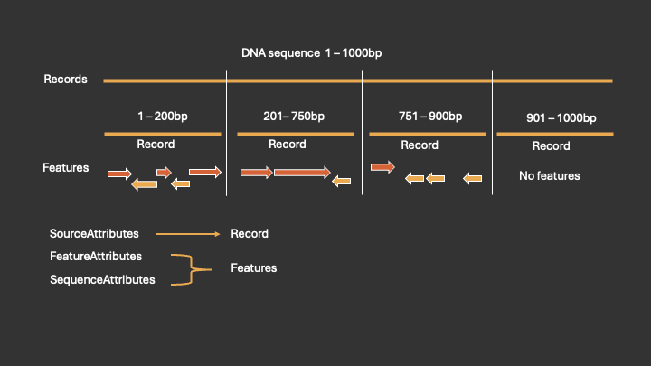
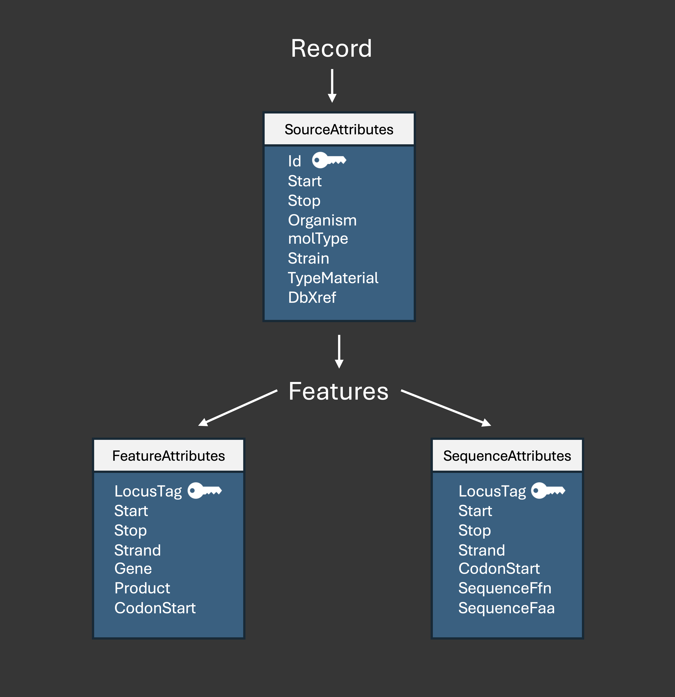

**File types and Parsing behaviour**

**Genbank (.gbk) & Embl (.embl)**


- We also provide the ability to convert these formats to gff3

Each genome file is a basic text file following a specific ruleset and genbank (gbk) and embl are similar but differ in the required formatting.


*Structure and Parsing*

Top Level is the Records type. There is one Records type per genome file.
Three types of macro have getters and setters for the data, these are SourceAttributes, FeatureAttributes, SequenceAttributes.

The next level is the Record type. There may be one or many Record in a Records (up to ~ 2000 but more usually ~ 50). Each Record has a DNA sequence which is calculated on the fly by slicing the total sequence of Records with the start and stop coordinates. Each Record also has a SourceAttributes macro which stores ID, total start and stop of the Record sequence (different to the CDS features start and stop below). It also stores the Organism among some other database comments.

{ loading=lazy }

The full structure of the SourceAttributes, FeatureAttributes and SequenceAttributes is:

{ width=500 }

SourceAttributes stores the following in an enum:

```
pub enum SourceAttributes {
    Start { value: RangeValue },
    Stop { value: RangeValue },
    Organism { value: String },
    MolType { value: String},
    Strain { value: String},
    CultureCollection { value: String},
    TypeMaterial { value: String},
    DbXref { value:String}
}
```

Where RangeValue can be either of:

```
RangeValue::Exact(value)
RangeValue::LessThan(value) 
RangeValue::GreaterThan(value)
```

Most RangeValues are Exact(value) with exceptions usually at the start and end of sequences, indicating that they are truncated.

Note that the start and stop of SourceAttributes relate to the sequence of the whole record

Each Record can have None or many hundreds of coding sequences, CDS (stored in the FeatureAttributes).
These are the predicted genes and contain annotation data per gene such as locus_tag (id), gene (may be empty), start, stop, strand (-1 or +1), codon start (1,2 or 3), product.

FeatureAttributes stores the following in an enum:

```
pub enum FeatureAttributes {
    Start { value: RangeValue },
    Stop { value: RangeValue },
    Gene { value: String },
    Product { value: String },
    CodonStart { value: u8 },
    Strand { value: i8 },
 //   ec_number { value: String }
}
```

currently EC_number is commented out but could be added back if there is demand

Each CDS also has a DNA sequence .ffn (calculated on the fly from the start, stop and strand) and a protein sequence .faa (translated on the fly from the start, stop, strand and codon_start). The sequences are stored in the SequenceAttributes.

SequenceAttributes stores the following in an enum:

```
pub enum SequenceAttributes {
    Start { value: RangeValue },
    Stop { value: RangeValue },
    SequenceFfn { value: String },
    SequenceFaa { value: String },
    CodonStart { value: u8 },
    Strand { value: i8 },
}
```

Note the start, stop, strand and codon start of SequenceAttributes and FeatureAttributes are identical

Sequences are stored separately in SequenceAttributes for efficiency. Although start, stop, locus_tag, and strand are duplicated in SequenceAttributes and FeatureAttributes, keeping them together may make it easier to slice the sequence and access the specific feature metadata at the same time.


