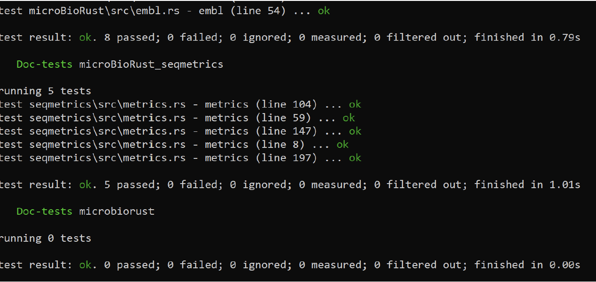
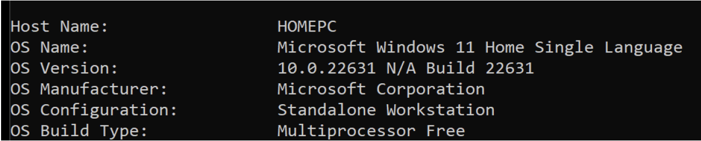
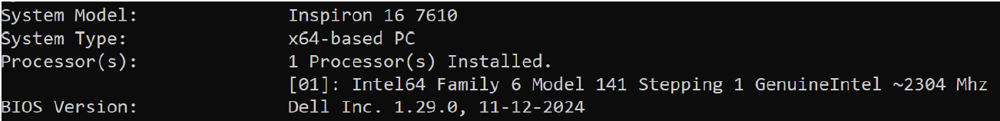

#Installation on Windows

:pencil2:   Author: Sreeram Peela

**Pre-requisites**

Rust is the programming language of choice for complex tasks these days. Installing micro**BioRust**
in windows requires Rust to be installed and the PATH variables to be added.  

We recommend installing Rust (and micro**BioRust**) using Windows Powershell (logged as admin).  

Alternately, the latest executables for GUI-based installation can be found here:  
[https://www.rust-lang.org/tools/install](https://www.rust-lang.org/tools/install)

1. Navigate to the directory of your choice and open Powershell in admin mode.
2. Download Rust executable from Powershell using the command:  

```
Invoke-WebRequest
-Uri https://static.rust-lang.org/rustup/dist/x86_64-pc-windows-msvc/rustup-init.exe
-OutFile rustup-init.exe
# Run the below command to start installation
.\rustup-init.exe```
  
```
> :mega: Installing Rust typically can be made through Visual Studio Community installer (Select option 1 when prompted). This documentation is written by selecting this option  

Installation VS community installer requires downloading additional packages - Win11_SDK and .. Please note that both these require almost 6GB of memory !!  
  
3.  Select ‘Default installation’ when prompted.  
4.  After a typical installation is over, close the powershell and reopen it to make changes in the PATH.  
  
**# Check if installation is successful**  
```
cargo help
```
  
For a successful installation, the above command will display different options and subcommands in Cargo. We will be using this for installing microBioRust (or any Rust package).

**Install microBioRust**  

The micro**BioRust** repo is being hosted on GitHub [here](https://github.com/LCrossman/microBioRust). We recommend using Git for smooth installation. Alternatively, users can download the repo as a ZIP file, uncompress it (with your own choice of tools), and navigate to the directory.  
  

**# Clone the repo using Git**  
```
git clone https://github.com/LCrossman/microBioRust.git  
```  

**# Navigate to the dir**  
```
cd microBioRust
```  

Inside the directory, one can use Cargo to build the library.  

```
# Inside the project directory
cargo build
```
  
>:arrow_right: The above command downloads and installs necessary dependencies for smooth functioning of the package. Please wait until all the required dependencies are installed and compilation for micro**BioRust** is completed.  
  
  
Once the package has been built, it is a general practise to test whether installation was successful.  For testing the installation, run the command:  

```
# test installation of the package  
cargo test
```
  
The above test instance runs over multiple files packed with the repo, and a final output message can help us in understanding errors. Typically, successful installation gives the following last few lines:  

{ loading=lazy }
  
Congratulations!! You have successfully installed microBioRust in your system. You can proceed with Getting started section of the documentation.  

> Session Information:  

{ loading=lazy }
{ loading=lazy }
